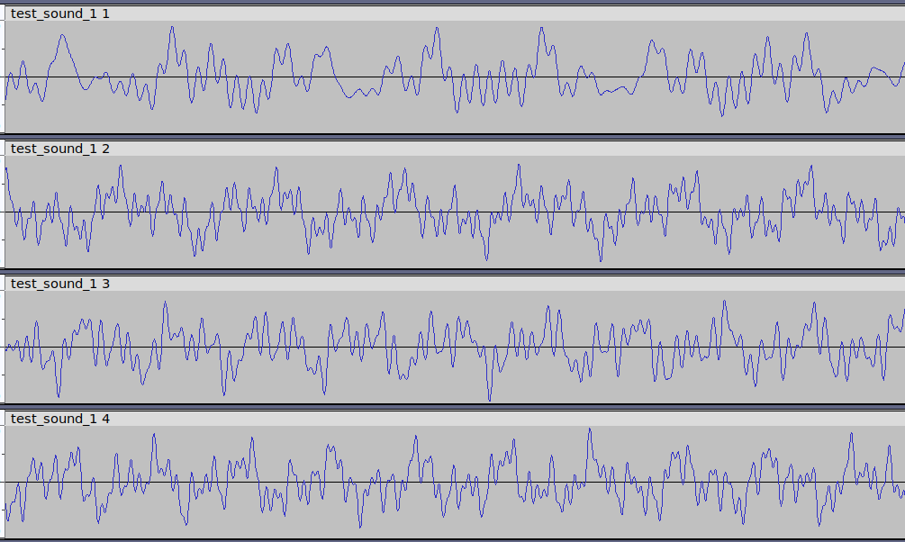

# **Wavaugmentate** 0.1.0
**Multichannel Audio Signal Augmentation Module**



  The module provides the Mcs class, which helps to perform augmentation of multi-channel audio signals for AI models learning purpose. 

# Input Data

WAV-file or NumPy array.
```
Array shape: (num_channels, num_samples).
```
# Output Data
Same types as in section [Input_data](#Input_data).

# Augmentation Methods 
1. Amplitude (volume change, inversion).
2. Time shift.
3. Echo.
4. Adding noise.
6. Time stretching. (**not implemented**)
7. Tempo change. (**not implemented**)
8. Pitch shift. (**not implemented**)
9. Adding silence. 
10. Frequency masking. (**not implemented**)
11. Time masking. (**not implemented**)
12. Combinations of methods.

# Additional Functionality
1. Generation multichannel tonal signals of desired frequency, amplitude, durance.
2. Generation multichannel speech-like signals of desired formants frequency, amplitude, durance.

# Interfaces
Signal augmentation can be applied by two ways:
1. As python module *Mcs* class methods.
2. As console application with CLI interface options.

## Python Module

Example 1 (procedural approach):
```Python
import wavaugmentate as wau

# File name of original sound.
file_name = "./outputwav/sound.wav"

# Create Mcs-object.
mcs = wau.Mcs()

# Read WAV-file to Mcs-object.
mcs.read(file_name)

# Change quantity of channels to 7.
mcs.split(7)

# Apply delays.
# Corresponds to channels quantity.
delay_list = [0, 150, 200, 250, 300, 350, 400]
mcs.delay_ctrl(delay_list)

# Apply amplitude changes.
# Corresponds to channels quantity.
amplitude_list = [1, 0.17, 0.2, 0.23, 0.3, 0.37, 0.4]
mcs.amplitude_ctrl(amplitude_list)

# Augmentation result saving by single file, containning 7 channels.
mcs.write("./outputwav/sound_augmented.wav")

# Augmentation result saving to 7 files, each 1 by channel.
# ./outputwav/sound_augmented_1.wav
# ./outputwav/sound_augmented_2.wav and so on.
mcs.write_by_channel("./outputwav/sound_augmented.wav")

```
Original signal is shown on picture:


Output signal with augmented data (channel 1 contains original signal without changes):


The same code as chain, Example 2:

```Python
import wavaugmentate as wau

delay_list = [0, 150, 200, 250, 300, 350, 400]
amplitude_list = [1, 0.17, 0.2, 0.23, 0.3, 0.37, 0.4]

# Create Mcs-object.
w = wau.Mcs(mcs)

# Apply all transformations of Example 1 in chain.
w.rd(file_name).splt(7).dly(delay_list).amp(amplitude_list).wr("./outputwav/sound_augmented_by_chain.wav")

# Augmentation result saving to 7 files, each 1 by channel.
w.wrbc("./outputwav/sound_augmented_by_chain.wav")
 
```
## CLI

use for details:
```
./wavaugmentate.py -h
```

command line interface  provides the same functionality.

Example 3 (procedural approach):
```shell
./wavaugmentate.py -i ./test_sounds/test_sound_1.wav -o ./outputwav/out.wav -d "100, 200, 300, 400"
./wavaugmentate.py -i ./outputwav/out.wav -o ./outputwav/out.wav -a "0.1, 0.2, 0.3, 0.4"

```

Example 4 (OOP approach):
```shell
./wavaugmentate.py -c 'rd("./test_sounds/test_sound_1.wav").dly([100, 200, 300, 400]).amp([0.1, 0.2, 0.3, 0.4]).wr("./outputwav/sound_delayed.wav")'

```
 ## How To
 ### Single file to several augmented
 Amplitudes and delays will be augmented by  code shown in example 5.
 Example 5 (single file augmentation):
 ```Python
file_name = "./outputwav/sound.wav"
v = wau.Mcs()
v.rd(file_name)  # Read original file with single channel.
file_name_head = "./outputwav/sound_augmented"

# Suppose we need 15 augmented files.
aug_count = 15
for i in range(aug_count):
    b = v.copy()
    # Apply random amplitude [0.3..1.7) and delay [70..130)
    # microseconds changes to each copy of original signal.
    b.amp([1], [0.7]).dly([100], [30])
    name = file_name_head + f"_{i + 1}.wav"
    b.write(name)
```

# Unit Tests

Just run:
```shell
pytest
```
Test coverage:
```
---------- coverage: platform linux, python 3.11.4-final-0 -----------
Name                       Stmts   Miss  Cover
----------------------------------------------
common_test_functions.py      15      0   100%
test_mcs_class.py            385      0   100%
test_wavaugmentate.py        293      0   100%
wavaugmentate.py             507     38    93%
----------------------------------------------
TOTAL                       1200     38    97%

```

# Reference
MCS - multi channel signal, it is NumPy array with shape (M_channels, N_samples).
| #|        *Mcs* class method        |            CLI option           |  Method alias   |     Description     |
|--|------------------------|---------------------------------|-----------------|------------------------|
|1 | read(path)             | -c 'rd(path)'              | rd        | Read MCS from WAV-file.|
|2 | write(path)            | -c 'wr(path)'              | wr        | Save MCS to WAV-file.  |
|3 | file_info(path)        | --info                     | info          | Returns WAV-file info. |
|4 |        -               | -i path                    |  -             | Input WAV-file path.   |
|5 |        -               | -o path                    |  -             | Output WAV-file path.  |
|6 | amplitude_ctrl([c1,c2..cm]) | -a "c1,c2..Cm"             | amp | Change amplitudes of channels. |
|7 | delay_ctrl([t1,t2..tm])    | -d "t1,t2..tm"             | dly | Add delays to channels.        |
|8 | echo _ctrl([t1,t2..tm],[c1,c2..cm]) |-d "t1,t2..tm / c1,c2..Cm"| echo |Add echo to channels. |
|9 | noise_ctrl([c1,c2..cm]) | -n "c1,c2..Cm"             | ns | Add normal noise to channels. | 
|10| copy         | -                          | cpy | Makes copy of MCS. |
|11| generate([f1,f2,f3..fm],duration,fs)|-| gen |Creates MCS and generates sine signal for each channel.|
|12| merge() | -| mrg | Merges all channels to single and returns  mono MCS.|
|13| pause_detect(relative_level)|-| pdt | Searches pauses by selected levels. Returns array-mask.|
|14| pause_set(pause_map,pause_sz) | - | - | Set pauses length to selected values. Returns updated MCS.|
|15| rms() | - | rms | Returns list of RMS calculated for object channels.|
|16| side_by_side(mcs) | - | sbs | Appends channels from mcs data as new channels.| 
|17| split(m_channels) | - | splt | Splits single channel to m_channels copies.|  
|18| sum(mcs2) | - | sum | Adds mcs2 data channels values to object channels data sample by sample. | 
|19| write_by_channel(path) | - | wrbc | Save MCS object channels to separate WAV-files.  |

 

## Documentation
Make clone of repository and look html-version of documentation:
[html-documentation](docs/_build/html/index.html)