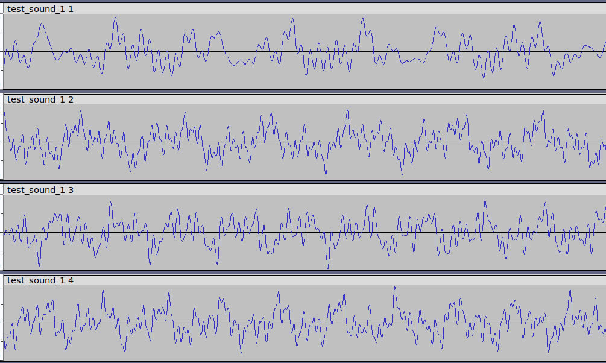

.. wavaugmentate documentation master file, created by
   sphinx-quickstart on Sun Sep  8 17:52:54 2024.
   You can adapt this file completely to your liking, but it should at least
   contain the root `toctree` directive.

Wavaugmentate package documentation
===================================

The module **wavaugmentate** makes audio signal augmentation conversions. It
provides the *Mcs*, *Aug* classes and *wavaug-cli* console utility.

- *Mcs* is an object for  multi-channel audio.
- *Aug* helps to perform augmentation data inside Mcs objects for AI models learning purpose.

GitHub: https://github.com/chetverovod/wavaugmentate

Input Data
----------

WAV-file or NumPy array.

.. code-block:: console

   Array shape: (num_channels, num_samples).

Output Data
-----------

Same types as in section **Input Data**.

Augmentation Methods 
--------------------

   #. Amplitude (volume change, inversion).
   #. Time shift.
   #. Echo.
   #. Adding noise.
   #. Time stretching (**not implemented**).
   #. Tempo change (**not implemented**).
   #. Pitch shift (**not implemented**).
   #. Adding silence. 
   #. Frequency masking (**not implemented**).
   #. Time masking (**not implemented**).
   #. Combinations of methods.

Additional Functionality
------------------------

#. Generation multichannel tonal signals of desired frequency, amplitude, durance.
#. Generation multichannel speech-like signals of desired formants frequency, amplitude, durance.

Interfaces
----------

Signal augmentation can be applied by two ways:
1. As python module *Mcs*, *Aug* classes methods.
2. As console application *wavaugmentate* with CLI interface options.

.. toctree::
   /source/usage.rst
   /source/aug.rst
   /source/mcs.rst
   /source/wavaugmentate.rst

 

.. note::
   This project is under active development.

